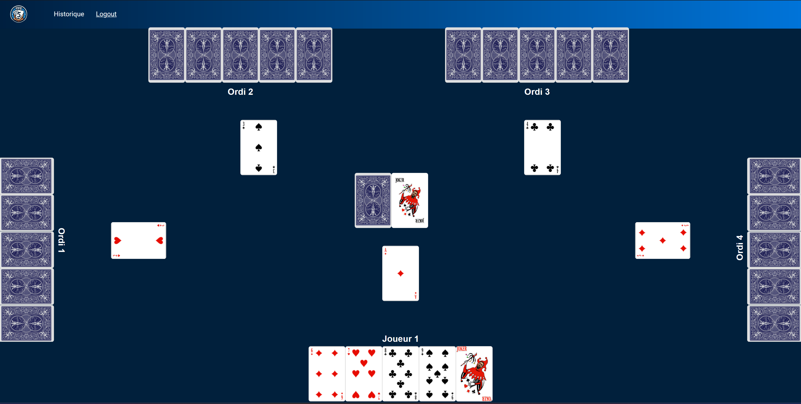

# Five-Card-Game v0.5(Bêta)

# ReadMe

## Utilisation

Pour faire fonctionner le projet, suivez ces étapes :

### Front

1. Clonez le dépôt sur votre machine locale.
2. Assurez-vous que toutes les dépendances requises sont installées en exécutant `npm install`.
3. Lancez l'application en exécutant `npm start`.
4. Accédez à l'application dans votre navigateur en ouvrant l'URL `http://localhost:4200`.

### Back

Veuillez consulter [ce lien](https://gitlab.takima.io/formation-dev-web/skeleton-web-app-school) et suivre les instruction des README correspondant.

### Jeux de test

Nous avons au préalable crée un utilisateur avec les informations de connexion suivantes :
- `username`: "Iranja"
- `password`: "123456"

Cependant libre à vous de créer autant d'utilisateur que vous le souhaitez avec notre page `Register` dédiée.

## Fonctionnalités

### Page Home

La page `Home` propose des des boutons `Play`, `Help` & `Options`.

- `Play` renvoie vers la page `Login` si l'utilisateur n'est pas identifié. S'il l'est renvoie vers la page `Game`.
- `Help` renvoie vers la page `Help`.

_!En développement pour la v0.5_
- `Options` renvoie vers la page des options (A développer)

### Navbar

La `Navbar` propose toujours le logo  cliquable qui ramène vers la page `Home`.
- Si l'utilisateur n'est pas authentifié elle propose un accès aux pages `Login` et `Register`.
- Si l'utilisateur est authentifié elle propose un accès à la page `Historique` et un bouton `Logout`.

### Page Login

Permet à l'utilisateur de s'authentifier avec son 'username' et son 'password'. Une authentification réussie met à jour la `Navbar` et renvoie vers la page `Home`.
Propose un accès à la page `Register`.

### Page Register

Permet à l'utilisateur de s'inscrire avec son 'username' , son 'email' et son 'password'. Une inscription réussie renvoie vers la page `Login`.
Propose un accès à la page `Login`.

### Page Game
_!En développement pour la v0.5_
(_La logique du jeu a été codée en java mais fonctionne uniquement sur invite de commande pour le moment_)
Permet de jouer contre l'ordinateur. (Bientôt une version en ligne!)

### Page Historique

Affiche l'historique des parties de l'utilisateur athentifié.

### Page Help

Dispose de 3 boutons déroulant: `Game rules`, `Our team`, `Contact us`, et d'un bouton `Back`.
- `Game rules` affiche les règles du jeu.
  
- `Our team` présente l'équipe de développement du jeu.
  

  _!En développement pour la v0.5_
- `Contact us` propose des boutons interactifs pour appeler, chatter ou envoyer un mail à l'équipe. 
- `Back` retourne vers la page `Home`.

# Fin

#### _NB : Par manque de temps l'ensemble des fonctionnalités n'ont pas été finalisées pour le 13/05/2024 (cf. _!En développement pour la v0.5_). Cependant si vous souhaitez voir une version plus finalisée je vous invite à reconsulter ce projet dans la même semaine. Merci de votre compréhension !_

